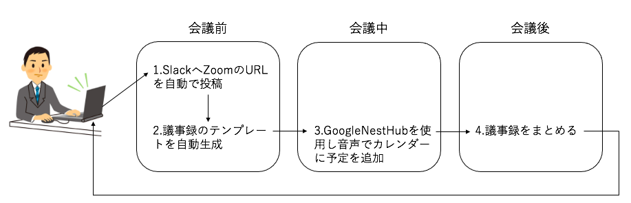

# 会議支援ツール"電光掲示"
学生証番号: 744906

氏名: 仁保　叡宥
## 背景
今日では会議支援ツールとして、自動文字起こしツールなどが利用されている。しかし自動文字起こしを行うのは会議終了後に行う作業であるため、会議前や会議中に利用できる会議支援ツールがあれば会議をより円滑にサポートできるのではないかと考え、会議前に利用できるツールとして議事録のテンプレートの自動作成ツールと会議中に利用できる音声でのカレンダーへの予定追加、自動リマインドツールの作成を行なった。

## 提案手法
会議支援の提案手法として、まず会議前に会議開始時間前にSlackへZoomのミーティングURLを投稿する。また、前回のミーティングの議事録から当日に書き込む議事録のテンプレートを作成する。そして会議中にGoogle Nest Hubを使用して音声でのGoogle Calendarへの予定の追加を行う。図1にそれぞれの会議支援ツールの利用時の流れを示す。

図1 会議支援ツールの利用の流れ

1. 前回の会議中に追加した次回会議予定時間の一定時間前にSlackへZoomの会議室のURLを自動で投稿する。
2. 前回の会議後にまとめた議事録から次回の会議の議題などの情報を取得し、議事録のテンプレートを自動生成する。
3. GoogleNestHubを使用して音声でGoogleCalendarに予定を追加し、Slackへ追加の通知を自動で行う。
4.会議前に作成した議事録のテンプレートに、会議中にメモした事柄をまとめる。

これらの作業を会議ごとに行い、会議の支援を行う。

## 実装
###### SlackへのZoomのミーティングURLの投稿
IFTTTを使用し、GoogleCalendarから会議の日程を取得する。そして取得した時間の一定時間前に任意の会議室のURLをSlackへ通知する。
###### 議事録のテンプレートの作成
GoogleAssistantを使用し、前回の会議後にまとめた内容を取得しIFTTTへ受け渡し、GoogleDocumentへ記入する。
###### 音声でのGoogle Calendarへの予定の追加
GoogleNestHubとGoogleカレンダーを同期する。そしてIFTTTを使用してSlackとGoogleCalendarの連携を行う。

## 評価
自動文字起こしツールなどの会議後のツール以外に、会議前や会議中に利用できるツールを作成するという課題において、上記の提案手法は会議を円滑にサポートするツールであると言える。実装したそれぞれの機能は、直接的に会議を支援するものではないが、これらの機能があることで少なからず会議準備の時間を短縮できるため、会議を円滑に進めるために必要なツールであると考える。

## まとめ
本実験では、会議支援ツールとして会議前や会議中に利用できる支援ツールがないことからそれらの実装を行った。既に上で述べたように、これらの機能は直接的に会議を支援するものではないが、会議準備の時間を確実に短縮できるために必要なツールであると結論づけた。今後の課題としては、本実験では主観的な評価しかしていないため、今後この実験を続けることがあれば、被験者を準備し第三者視点の客観的な評価をするべきだと考える。
