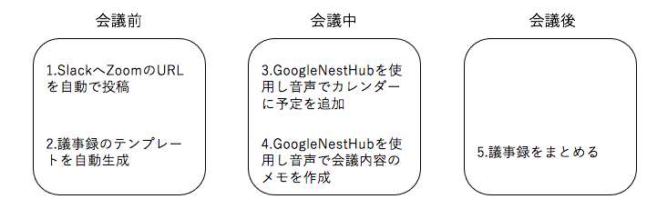
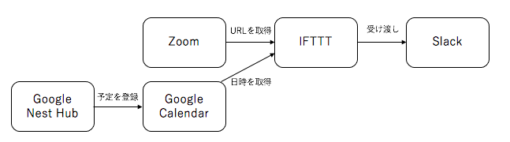
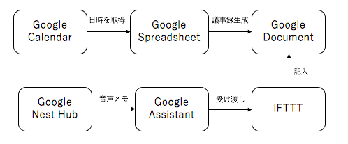
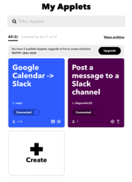
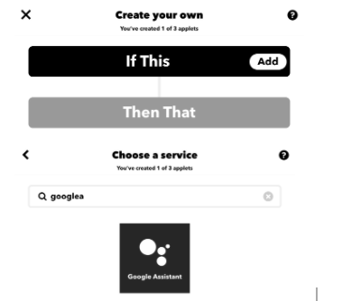
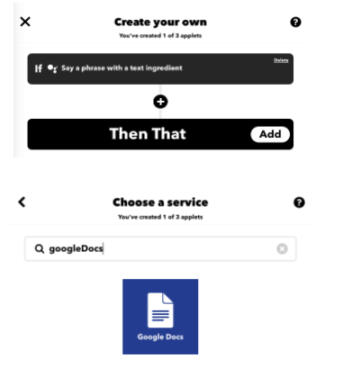
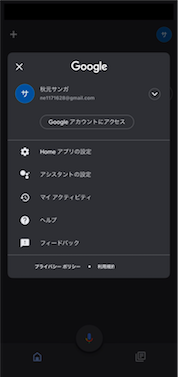
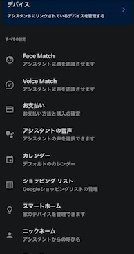

# 会議支援ツール"伝行掲示"
学生証番号: 744906

氏名: 仁保　叡宥
## 背景
今日では新型コロナ感染症の影響でオンライン会議を行う機会が極端に増えているということをよく耳にする。そこから発想を得て会議支援ツールに目を付けた。オンライン会議でも対面での会議でも、メモを取ったり、カレンダーに予定を追加したり、議事録を作成したりと多くの作業がある。これらの作業の1つ1つはそれほど時間を費やすものではないが、全ての作業時間を合わせるとそれなりに時間がかかる。そこで、これらの作業時間を短縮することができる会議支援ツールを作成した。

## 概要
最近では会議支援ツールとして、自動文字起こしツールなどが利用されている。しかし自動文字起こしを行うのは会議終了後に行う作業であるため、会議前や会議中に利用できる会議支援ツールがあれば会議をより円滑にサポートできるのではないかと考えた。そこで、会議前に利用できるツールとして議事録のテンプレートの自動作成ツールと会議中に利用できる音声でのカレンダーへの予定追加、自動リマインドツールの作成を行なった。

## 提案手法
会議支援の提案手法として、まず会議前に会議開始時間前にSlackへZoomのミーティングURLを投稿する。このシステムを実装することで、会議の開催者が会議前に参加者全員にミーティングのURLを提示する手間が省けるため、作業時間の短縮ができる。また、前回のミーティングの議事録から当日に書き込む議事録のテンプレートを作成する。このシステムを実装することで、書記担当者が会議中に行う議事録作成の作業負担を少しでも減らすことができる。そして会議中にGoogle Nest Hubを使用して音声でのGoogle Calendarへの予定の追加を行う。このシステムを実装することで、PCを使うことができない会議中でも、PCを使わずに予定の追加が可能になる。最後に会議中にGoogle Nest Hubを使用して音声での会議内容のメモ機能を作成する。このシステムを実装することで、PCを使うことができない会議中でも、会議内容のメモをとることができる。図1にそれぞれの会議支援ツールの利用時の流れを示す。

図1 会議支援ツールの利用の流れ

1. 前回の会議中に追加した次回会議予定時間の一定時間前にSlackへZoomの会議室のURLを自動で投稿する。
2. 前回の会議後にまとめた議事録から次回の会議の議題などの情報を取得し、議事録のテンプレートを自動生成する。
3. GoogleNestHubを使用して音声でGoogleCalendarに予定を追加し、Slackへ追加の通知を自動で行う。
4. GoogleNestHubを使用して音声で会議内容のメモを作成する。
5. 会議前に作成した議事録のテンプレートに、会議中にメモした事柄をまとめる。
以下の図2,3は、それぞれの概要図である。

図2 音声でのGoogleCalendarへの予定の追加とSlackへの通知

図3 議事録の自動生成と、音声でのメモの作成

これらの作業を会議ごとに行い、会議の支援を行う。

## 実装
### SlackへのZoomのミーティングURLの投稿
IFTTTを使用し、GoogleCalendarから会議の日程を取得する。そして取得した時間の一定時間前に任意の会議室のURLをSlackへ通知する。以下は実装時の画面である。

上の画面からGoogleCalendar->Slackを選択する。次に取得するカレンダーを選択し、通知したいミーティングURLを入力することで、カレンダーに記載された時間前に自動的にミーティングURLをSlackへ通知することができる。

### 議事録のテンプレートの作成
GoogleAssistantを使用し、前回の会議後にまとめた内容を取得しIFTTTへ受け渡し、GoogleDocumentへ記入する。上のIFTTT使用時の画面から、createを選択する。次にトリガーの設定を行う。GoogleAssistantをthisとして選択する。以下は、GoogleAssistantをthisとして選択する際の画面である。

最後に、GoogleDocsをthatとして選択する。以下はGoogleDocsを選択する際の画面である。

### 音声でのGoogle Calendarへの予定の追加
GoogleNestHubとGoogleカレンダーを同期する。GoogleHomeの設定から、アシスタントの設定を選択する。

アシスタントの設定を選択した後に、カレンダーを選択し、GoogleNestHubと同期させたいカレンダーを選ぶ。

### 音声での会議内容のメモの作成
IFTTTを使用しGoogleNesuHubが音声で受け取ったメモの情報をGoogleDocumentへ記入する。上記の、議事録のテンプレートの作成の際と同じやり方で設定を行う。

## 評価
本実験で作成した会議支援ツールでは、作業時間と手間の削減を目標に実装を行った。4つの会議支援ツールの実装で、カレンダーへの予定の追加や会議内容のメモなどの、オンライン会議中には並行してできなかった作業を並行してできるようにした。また、議事録テンプレートの作成や会議参加者へのミーティングURLの通知などの、オンライン会議前に行う作業の時間短縮も行った。そのため、これらの会議支援ツールはオンライン会議における作業時間と手間の削減において、必要なツールであると言える。

## まとめ
本実験では、会議支援ツールとして会議前や会議中に利用できる支援ツールがないことからそれらの実装を行った。既に上で述べたように、これらの機能は直接的に会議を支援するものではない。しかし、会議準備の時間を確実に短縮できるために必要なツールであると結論づけた。今後の課題としては、本実験では主観的な評価しかしていない。したがって、今後この実験を続けることがあれば、被験者を準備し第三者視点の客観的な評価をするべきだと考える。
